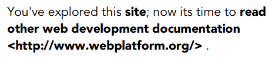
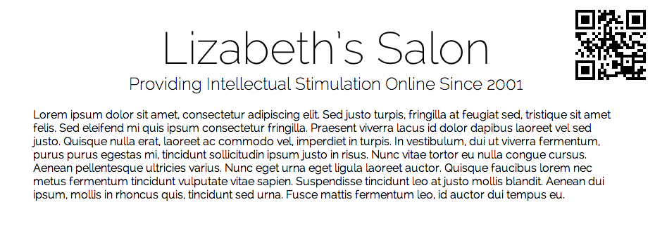

# Tips And Tricks For Print Style Sheets

Print continues to be treated somewhat cursorily by most Web designers, who tend
to be obsessed with pixels rather than printers. **In the real world**, a
significant portion of people rely on pages printed from websites for reference:
there’s still something about having a physical sheet of paper in one’s hands,
even in this age of digital saturation.

Web developers can take several steps to bridge the gap between the worlds of
printers and LCD screens:

* Treat print as an equal partner in [adaptive and responsive design](http://uxdesign.smashingmagazine.com/2012/11/08/ux-design-qa-with-christian-holst/).
* Print background images and colors, where appropriate.
* Add visible URLs or scannable links for easy reference from the printed page.
* Use CSS filters to improve the result of printed graphics.

## Design For Print, Not Screen

First, let’s cover the basics. Modern print style sheets are typically placed
within a media query:

<pre><code>@media print {  
  
}</code></pre>

Recreating the entire CSS for your website is not necessary because the default
styles will, on the whole, be inherited by the print query; only the differences
need to be defined. Most browsers will automatically reverse colors when
printing in order to save toner, but this won’t have the same degree of quality
as a handcrafted solution. For best results, **make color changes explicit**. At
the very least, a basic print media query should consist of the following:

<pre><code>@media print {  
   body {  
      color: #000;  
      background: #fff;  
   }  
}</code></pre>

While `display: none` has rightly been [derided in responsive design](http://laurakalbag.com/display-none/), 
it is entirely appropriate for print style sheets: in most cases, our goal is 
not to recreate a screenshot of an entire page, but to provide a concise, 
well-designed print version of it. As a second step, eliminate page elements 
that are simply irrelevant in print, including navigation bars and background 
images.

<pre><code>/* Default styles */  
  
h1 {  
   color: #fff;  
   background: url(banner.jpg);  
}  
  
@media print {  
   h1 {  
      color: #000;  
      background: none;  
   }  
  
   nav, aside {  
      display: none;  
   }  
}</code></pre>

Writing a print style sheet is one of the few times when you’ll ever use
centimeters or inches in CSS. Largely irrelevant to screens, real-world
measuring systems become very useful in print. To ensure that you are using the
printed page effectively, write CSS to display your content edge to edge,
negating any margins or padding that may be present, and balance this with an
`@page` rule:

<pre><code>@media print {  
   h1 {  
      color: #000;  
      background: none;  
   }  
  
   nav, aside {  
      display: none;  
   }  
  
   body, article {  
      width: 100%;  
      margin: 0;  
      padding: 0;  
   }  
  
   @page {  
      margin: 2cm;  
   }  
}</code></pre>

For content to which users can be expected to add handwritten notes on the page,
such as educational material, you might consider increasing the print margin.

We also need to ensure that content is not broken across pages when printed. One
obvious step is to prevent headings from being printed at the bottom of the
page:

<pre><code>h2, h3 {  
   page-break-after: avoid;  
}</code></pre>

Another rule will prevent images from bleeding over the edge of the printed 
page:

<pre><code>img {  
   max-width: 100% !important;  
}</code></pre>

A third will ensure that articles always start on a fresh page:

<pre><code>article {  
   page-break-before: always;  
}</code></pre>

Finally, we can prevent large elements, such as unordered lists and images, from
being split across multiple pages.

<pre><code>ul, img {  
   page-break-inside: avoid;  
}</code></pre>

While these declarations are not exhaustive, they’re a good start.

## Force Background Images And Colors

On some websites, such as portfolios, background images and colors are an
important visual component. If the user is printing from a WebKit browser
(Google’s Chrome or Apple’s Safari), we can force the printer to render the
colors as seen on screen (i.e. force any background images and colors to appear
on the printed page). Generally speaking, we would do this for color printers,
which we can test for in a separate media query:

<pre><code>@media print and (color) {  
   * {  
      -webkit-print-color-adjust: exact;  
      print-color-adjust: exact;  
   }  
}</code></pre>

Sadly, there is (as yet) no immediate equivalent in Firefox, Opera or Internet
Explorer.

## Expand External Links For Print

We can’t (yet) directly interface with a printed page to explore links, so link
URLs should be visible on the printed version of the Web page. To keep the page
relatively clean, I prefer to expand only outbound links in articles, and
suppress internal ones. If you’ve used relative URLs on your website for local
links, you can easily do this through an attribute selector and `:after` pseudo-
classes, thus preventing internal links and links around images from being
printed:

<pre><code>@media print {  
   article a {  
      font-weight: bolder;  
      text-decoration: none;  
   }  
  
   article a[href^=http]:after {  
      content:" &lt;" attr(href) "&gt; "; 
   }  
}</code></pre>

Take the following HTML code and content:

<pre><code>&lt;p&gt;You’ve explored this &lt;a href="/blog"&gt;website&lt;/a&gt;; now it’s time to &lt;a href="http://www.webplatform.org/"&gt;read other Web development documentation&lt;/a&gt;.&lt;/p&gt;</code></pre>

Here is the printed result:

One issue is that anchor links and links around images will also be expanded on
the printed page. We can fix the anchor links fairly readily with a
countermanding CSS rule:

<pre><code>article a[href^="#"]:after {  
   content: "";  
}</code></pre>

Links around images are rather more difficult, because CSS does not currently
allow for the selection of an element based on its children. Ideally, links
around images would have a class that we could target via CSS. Longer term, CSS4
features a parent selector that will do the job:

<pre><code>$a:after > img {  
   content: "";  
}</code></pre>

CSS4 will also make expanding external links easier:

<pre><code>a:not(:local-link):after {  
   content:" &lt;" attr(href) "&gt; ";  
}</code></pre>

All of these approaches assume that users will continue to type in URLs by hand.
A better solution is to make the digital version of the page easier to access by
providing a matching QR code.

## Print QR Codes For Easy URL References

Often regarded as an advertising eyesore, QR codes have their place in certain
circumstances. One obvious example is providing an easily-scanned sigil on a
printed Web page that enables the user to return to the live version without
having to type the URL.

*Web page printed with a self-referential QR code. [Larger view](img/lizabeth_big.png).*

To create the matching QR code, we’ll use Google’s Chart API, which has four
required components:

* The kind of chart information we want Google to deliver (qr, in our case);
* The rendered size of the QR sigil, in pixels;
* The URL to encode;
* The form of character encoding to use.

We’d typically associate the URL with a heading element at the top of the page:

<pre><code>&lt;header&gt;
&lt;h1&gt;Lizabeth’s Salon&lt;/h1&gt;  
&lt;h2&gt;Providing Intellectual Stimulation Online Since 2001&lt;/h1&gt;
&lt;/header&gt;</code></pre>

To create the printed result, we’ll provide a margin on the right side of the h1
that is large enough for the heading, and then position a QR code in that area:

<pre><code>header h1 {  
   margin-right: 200px;  
   margin-bottom: 2rem;  
   line-height: 1.5;  
}</code></pre>

Because the QR code will be unique to each page, this would be added as an
embedded style sheet:

<pre><code>@media print {  
   header h1:after {  
      content: url(https://chart.googleapis.com/chart?cht=qr&amp;chs=150x150&amp;chl=http://yourdomain.com&amp;choe=UTF-8);  
      position: absolute;  
      right: 0;  
      top: 0;  
   }  
}</code></pre>

This approach has the downside of forcing the developer to enter a URL
individually for each page into the API code. If your Web host is running PHP,
you can provide the URL of the current page automatically:

<pre><code>@media print {  
   h1:after {  
      content: url(https://chart.googleapis.com/chart?cht=qr&amp;chs=150x150&amp;chl=http://&lt;?=$_SERVER["SERVER_NAME"].$_SERVER["REQUEST_URI"];?&gt;&amp;choe=UTF-8);  
      position: absolute;  
      right: 0;  
      top: 0;  
   }  
}</code></pre>

For WordPress:

<pre><code>@media print {  
   h1:after {  
      content: url(https://chart.googleapis.com/chart?cht=qr&amp;chs=150x150&amp;chl=http://&lt;?phpthe_permalink();?&gt;&amp;choe=UTF-8);  
      position: absolute;  
      right: 0;  
      top: 0;  
   }  
}</code></pre>

Obviously, both of the solutions above will only work on PHP and WordPress
pages.

## Use CSS3 Filters To Improve Print Quality

Browsers often have issues with printing out banner images, especially if the
banners are white against a dark background:

<table>
	<tbody>
		<tr>
			<th>Logo as a solid image</th>
			<th>Printed result</th>
		</tr>
		<tr>
			<td></td>
			<td></td>
		</tr>
		<tr>
			<th>Logo as an alpha-masked PNG</th>
			<th>Printed result</th>
		</tr>
		<tr>
			<td></td>
			<td></td>
		</tr>
	</tbody>
</table>

In theory, you could use a CSS sprite to switch between different versions of
the logo for print, but that would mean doubling the file size for potentially
little benefit. Instead, I recommend using CSS filters (and their SVG
equivalent, for Firefox) to invert the image just before it hits the printed
page:

<pre><code>@media print {  
   header {  
      background: none;  
      color: #000;  
   }  
  
   header img {  
      filter: url(inverse.svg#negative);  
      -webkit-filter: invert(100%);  
      filter: invert(100%);  
   }  
}</code></pre>

CSS3 filters do what you’d expect — invert the colors in header images, turning
black to white and vice versa — but they only work in Chrome and Safari. To
cover Firefox, we need a different approach — the equivalent filter written as a
separate SVG file:

<pre><code>&lt;svg xmlns="http://www.w3.org/2000/svg"&gt;
&lt;filter id="negative"&gt;
&lt;feColorMatrix values="-1 0 0 0 1   
0 -1 0 0 1   
0 0 -1 0 1   
0 0 0 1 0" /&gt;
&lt;/filter&gt;
&lt;/svg&gt;</code></pre>

The workings of the `feColorMatrix` SVG filter are a little complex to cover
here. Much more information can be found in the article "[Applying Color Tints to Web Pages With SVG Filters and JavaScript](http://dev.opera.com/articles/view/applying-color-tints-to-web-pages-with-s/)" 
on Dev.Opera.

The result of printing either form of logo (i.e. alpha-masked PNG or solid-black
background) is now this:

## Conclusion

Due in part to the fact that printer use is **not tracked by website analytics
software** and, thus, lacks strong metrics (although achieving this is possible,
too, which we may discuss in a future article), print tends to be broadly
ignored by Web developers. This is somewhat understandable, because most of the
time we only read and browse pages online. As a result, developers tend to
develop websites for the screens and devices in front of them, rather than for
the printer at the other end of the office.

On the other hand, even if people only occasionally need to print something from
the Web, it would be ideal if the page design adapted to the printer, just as
modern websites adapt to various screen sizes and devices. Print should be
considered another aspect of adaptive design, usability and accessibility, and
an equally important part of Web development.

By treating print as another aspect of adaptive design, we fulfill the needs of
more website users — and at the same time, save ink, paper and other resources,
all of which are important aspects of **sustainable design**.

### MORE RESOURCES

A List Apart has a long and laudable history of supporting print style sheets
through its articles and tutorials. While some of the following resources are
now fairly old, they remain relevant to anyone who wishes to explore print as an
equal partner in Web design.

* [CSS Design: Going to Print](http://www.alistapart.com/articles/goingtoprint/), Eric Meyer (10 May 2002)
* [Improving Link Design for Print](http://www.alistapart.com/articles/improvingprint/), Aaron Gustafson (19 September 2005)
* [Building Books With CSS3](http://www.alistapart.com/articles/building-books-with-css3/), Nellie McKesson (12 June 2012)
* [How To Set Up A Print Style Sheet](http://coding.smashingmagazine.com/2011/11/24/how-to-set-up-a-print-style-sheet/), Christian Krammer (24 November 2011)